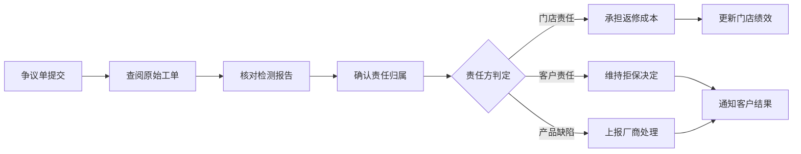

## 1. 产品概述

维修质保卡核销平台是面向手机维修连锁门店、客服人员和售后主管的数据驱动型 Web 应用，核心目标是让保修承诺可查询、可核销、可追责，实现质保全生命周期的数字化管理。

- **主要用途**：质保卡发放、客户查询、核销受理、返修处理、门店审核、数据统计
- **解决问题**：传统纸质质保卡易丢失、难追溯、核销流程不透明、责任界定困难
- **目标用户**：门店维修技师、客服专员、售后主管、门店经理
- **产品价值**：提升售后服务效率，降低返修成本，增强客户信任，优化门店管理

## 2. 核心功能

### 2.1 用户角色

| 角色 | 注册方式 | 核心权限 |
|------|----------|----------|
| 门店技师 | 工号登录 | 发放质保卡、提交核销申请、记录返修处理 |
| 客服专员 | 工号登录 | 客户查询、核销受理、短信通知、回访记录 |
| 售后主管 | 管理员账号 | 门店审核、争议处理、数据统计、黑名单管理 |
| 门店经理 | 工号登录 | 查看门店数据、员工绩效、质保卡管理 |

### 2.2 功能模块

1. **质保卡发放页**：根据维修项目生成电子质保卡，记录机型、维修内容、保修天数、排除条款
2. **客户查询页**：手机号或卡号查询剩余天数、覆盖范围、使用记录
3. **核销受理页**：登记故障现象、上传现场照片、出具检测结论
4. **返修处理页**：免费维修、折价更换、拒保说明、升级主管
5. **门店审核页**：处理争议单、查看原始工单、确认责任归属
6. **质保统计页**：发放量、核销率、拒保原因、返修成本、门店排行、临期提醒

### 2.3 页面详情

| 页面名称 | 模块名称 | 功能描述 |
|----------|----------|----------|
| 质保卡发放 | 维修信息录入 | 选择门店、机型、维修项目、填写IMEI、客户手机号 |
| 质保卡发放 | 保修条款配置 | 设置保修天数、自定义排除条款、自动生成卡号 |
| 质保卡发放 | 电子卡生成 | 生成二维码/链接、支持短信发送、客户电子签收 |
| 客户查询 | 查询入口 | 手机号/卡号搜索、验证码验证、历史记录展示 |
| 客户查询 | 质保详情 | 剩余天数倒计时、覆盖范围说明、核销历史时间线 |
| 核销受理 | 故障登记 | 故障现象描述、现场照片上传、故障分类选择 |
| 核销受理 | 检测评估 | 检测结论、保修判定、预计维修时长 |
| 返修处理 | 处理方案 | 免费维修/折价更换/拒保三选一、配件成本记录 |
| 返修处理 | 升级流程 | 拒保说明填写、主管审批通道、客户沟通记录 |
| 门店审核 | 争议处理 | 争议单列表、原始工单查阅、责任判定 |
| 门店审核 | 黑名单管理 | 异常客户标记、风险提示、历史欺诈记录 |
| 质保统计 | 数据看板 | 发放量趋势、核销率分析、拒保原因分布 |
| 质保统计 | 成本分析 | 返修成本统计、门店排行、临期质保提醒 |
| 质保统计 | 回访记录 | 客户满意度、回访时间线、问题跟进 |

## 3. 核心流程

### 3.1 质保卡发放流程

### 3.2 核销受理流程

### 3.3 门店审核流程

## 4. 用户界面设计

### 4.1 设计风格
- **主色调**：深邃蓝 (#165DFF) - 代表专业、可靠、可信赖
- **辅助色**：翡翠绿 (#00B42A) - 成功/保修有效；警示橙 (#FF7D00) - 临期/待处理；危险红 (#F53F3F) - 拒保/黑名单
- **中性色**：深灰 (#1D2129) 用于标题，中灰 (#4E5969) 用于正文，浅灰 (#C9CDD4) 用于边框
- **背景**：渐变深色仪表盘风格，配合卡片式布局增强数据层次感
- **按钮风格**：圆角 8px，轻微投影，hover 时上浮 2px 动画
- **字体**：标题使用 "Inter" 加粗，数据使用 "JetBrains Mono" 等宽字体增强数字可读性
- **布局风格**：左侧固定导航栏 + 右侧内容区，卡片式数据模块，大量使用数据可视化图表
- **图标风格**：线性图标 (Lucide React)，统一 20px 尺寸，与文字间距 8px

### 4.2 页面设计概述

| 页面名称 | 模块名称 | UI 元素 |
|----------|----------|---------|
| 质保卡发放 | 表单区 | 两列表单布局、下拉选择器、日期选择器、动态条款输入 |
| 质保卡发放 | 预览区 | 电子卡实时预览、二维码生成、渐变色卡面设计 |
| 客户查询 | 搜索区 | 大尺寸搜索框、Tab 切换（手机号/卡号）、验证码输入 |
| 客户查询 | 结果区 | 质保卡信息卡、倒计时动效、时间线记录展示 |
| 核销受理 | 登记区 | 多步骤向导、照片上传拖拽区、富文本描述框 |
| 核销受理 | 检测区 | 故障分类树、保修判定开关、预计时长滑块 |
| 返修处理 | 方案区 | 三选一卡片选择器、成本明细表格、备注输入区 |
| 返修处理 | 升级区 | 拒保原因模板、审批流转、客户沟通记录 |
| 门店审核 | 争议区 | 数据表格带筛选、工单详情抽屉、责任判定下拉 |
| 门店审核 | 黑名单区 | 红色警示卡片、风险等级标签、历史记录折叠 |
| 质保统计 | 看板区 | 数据指标卡、趋势折线图、堆叠柱状图、饼图 |
| 质保统计 | 列表区 | 门店排行榜、临期提醒表格、回访记录列表 |

### 4.3 响应式
- **桌面优先**设计，断点 1440px / 1024px / 768px
- **侧边导航**：桌面展开、平板收起为图标、移动端底部 Tab 栏
- **表格组件**：桌面完整展示、平板横向滚动、移动端卡片化展示
- **触控优化**：移动端按钮最小 44x44px，表单输入框增加底部间距避免键盘遮挡

### 4.4 数据可视化
- **图表库**：Recharts
- **仪表盘**：环形进度图展示核销率，数字滚动动画
- **趋势图**：面积图展示月度发放量趋势
- **分布图**：饼图/玫瑰图展示拒保原因分布
- **排行榜**：横向柱状图带门店名称和数值对比
