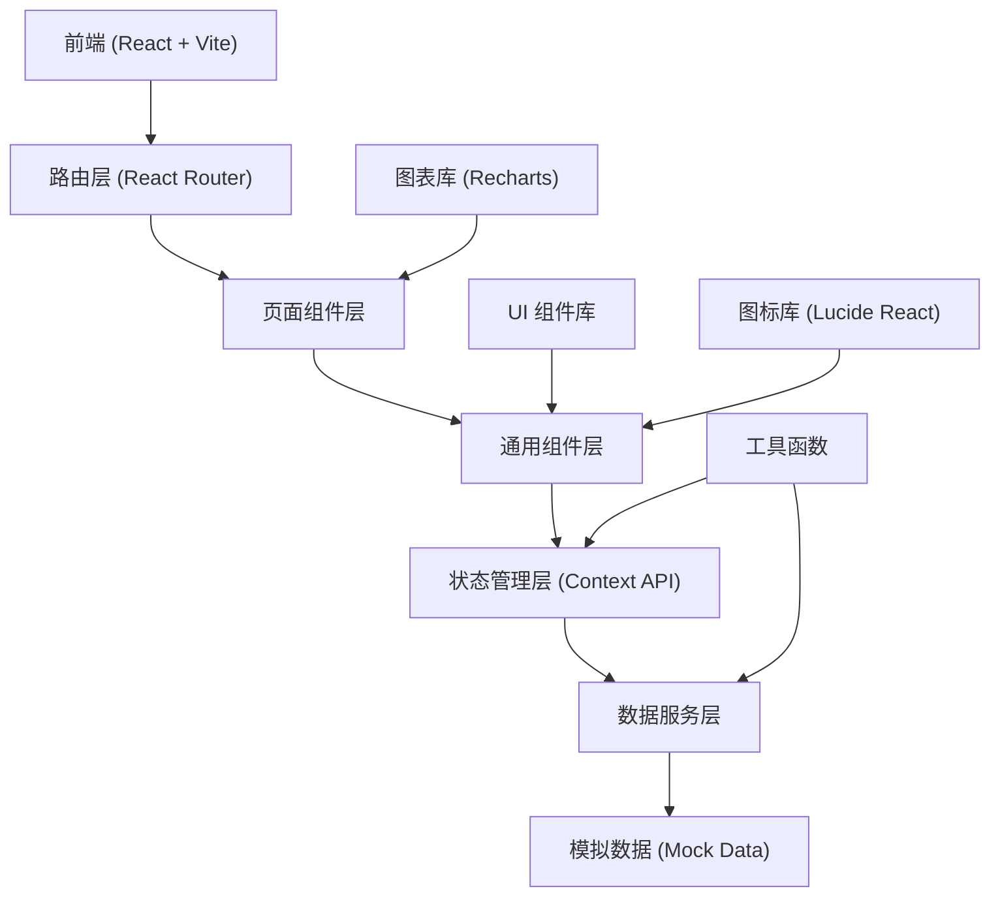
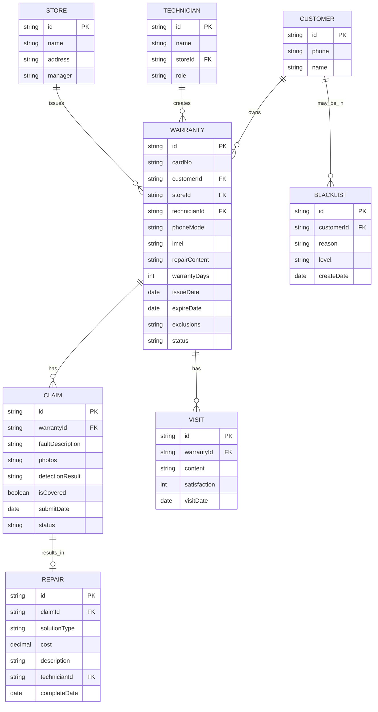

## 1. 架构设计



## 2. 技术描述

- **前端框架**：React@18.2.0 + TypeScript
- **构建工具**：Vite@5.0.0
- **样式方案**：TailwindCSS@3.4.0 + CSS Variables
- **路由管理**：React Router DOM@6.20.0
- **状态管理**：React Context API + useReducer
- **图表可视化**：Recharts@2.10.0
- **图标库**：Lucide React@0.294.0
- **二维码生成**：qrcode.react@3.1.0
- **日期处理**：dayjs@1.11.10
- **后端**：无后端，使用 Mock 数据模拟
- **数据库**：LocalStorage 持久化 + 内存数据

## 3. 目录结构

```
src/
├── components/          # 通用组件
│   ├── Layout/         # 布局组件
│   │   ├── Sidebar.tsx
│   │   ├── Header.tsx
│   │   └── Container.tsx
│   ├── Card/           # 卡片组件
│   │   ├── WarrantyCard.tsx
│   │   ├── StatCard.tsx
│   │   └── StatusBadge.tsx
│   ├── Form/           # 表单组件
│   │   ├── Input.tsx
│   │   ├── Select.tsx
│   │   ├── DatePicker.tsx
│   │   └── Uploader.tsx
│   ├── Table/          # 表格组件
│   │   ├── DataTable.tsx
│   │   └── Pagination.tsx
│   └── Chart/          # 图表组件
│       ├── LineChart.tsx
│       ├── BarChart.tsx
│       └── PieChart.tsx
├── pages/              # 页面组件
│   ├── Issue/          # 质保卡发放
│   ├── Query/          # 客户查询
│   ├── Accept/         # 核销受理
│   ├── Repair/         # 返修处理
│   ├── Audit/          # 门店审核
│   └── Stats/          # 质保统计
├── context/            # 状态管理
│   ├── WarrantyContext.tsx
│   └── AuthContext.tsx
├── data/               # 模拟数据
│   ├── warranty.ts
│   ├── stores.ts
│   └── models.ts
├── types/              # TypeScript 类型
│   └── index.ts
├── utils/              # 工具函数
│   ├── formatter.ts
│   ├── validator.ts
│   └── qrcode.ts
├── hooks/              # 自定义 Hooks
│   ├── useWarranty.ts
│   └── useModal.ts
├── App.tsx
├── main.tsx
└── index.css
```

## 4. 路由定义

| 路由路径 | 页面名称 | 访问权限 |
|----------|----------|----------|
| / | 首页仪表盘 | 所有角色 |
| /issue | 质保卡发放 | 门店技师、客服 |
| /query | 客户查询 | 所有角色 |
| /accept | 核销受理 | 客服、技师 |
| /repair | 返修处理 | 技师、主管 |
| /audit | 门店审核 | 售后主管 |
| /stats | 质保统计 | 主管、经理 |

## 5. 数据模型

### 5.1 ER 图



### 5.2 核心数据类型定义

```typescript
// 质保卡
interface Warranty {
  id: string;
  cardNo: string;
  customerName: string;
  phone: string;
  phoneModel: string;
  imei: string;
  repairContent: string;
  warrantyDays: number;
  issueDate: string;
  expireDate: string;
  exclusions: string[];
  storeId: string;
  storeName: string;
  technician: string;
  status: 'active' | 'expired' | 'cancelled';
  claims: Claim[];
  signed: boolean;
  signDate?: string;
}

// 核销申请
interface Claim {
  id: string;
  warrantyId: string;
  cardNo: string;
  faultDescription: string;
  photos: string[];
  detectionResult: string;
  isCovered: boolean | null;
  rejectReason?: string;
  submitDate: string;
  status: 'pending' | 'approved' | 'rejected' | 'disputed';
  repair?: Repair;
}

// 返修记录
interface Repair {
  id: string;
  claimId: string;
  solutionType: 'free' | 'discounted' | 'rejected' | 'escalated';
  cost: number;
  parts: { name: string; cost: number }[];
  description: string;
  technician: string;
  completeDate: string;
  customerSigned: boolean;
}

// 门店
interface Store {
  id: string;
  name: string;
  address: string;
  manager: string;
  totalWarranties: number;
  totalClaims: number;
  approvalRate: number;
}

// 黑名单
interface BlacklistItem {
  id: string;
  customerName: string;
  phone: string;
  reason: string;
  level: 'low' | 'medium' | 'high';
  historyCount: number;
  createDate: string;
}
```

### 5.3 统计数据类型

```typescript
interface StatsData {
  totalWarranties: number;
  activeWarranties: number;
  totalClaims: number;
  approvalRate: number;
  avgRepairCost: number;
  expiringSoon: number;
  
  monthlyTrend: { month: string; issued: number; claimed: number }[];
  rejectReasons: { reason: string; count: number }[];
  storeRanking: { store: string; warranties: number; claims: number; rate: number }[];
  repairCostTrend: { month: string; cost: number }[];
}
```

## 6. 状态管理设计

### 6.1 WarrantyContext 状态

```typescript
interface WarrantyState {
  warranties: Warranty[];
  claims: Claim[];
  repairs: Repair[];
  stores: Store[];
  blacklist: BlacklistItem[];
  currentWarranty: Warranty | null;
  currentClaim: Claim | null;
  loading: boolean;
  error: string | null;
}

type WarrantyAction =
  | { type: 'SET_WARRANTIES'; payload: Warranty[] }
  | { type: 'ADD_WARRANTY'; payload: Warranty }
  | { type: 'UPDATE_WARRANTY'; payload: Warranty }
  | { type: 'SET_CLAIMS'; payload: Claim[] }
  | { type: 'ADD_CLAIM'; payload: Claim }
  | { type: 'UPDATE_CLAIM'; payload: Claim }
  | { type: 'SET_CURRENT_WARRANTY'; payload: Warranty | null }
  | { type: 'SET_LOADING'; payload: boolean }
  | { type: 'SET_ERROR'; payload: string | null };
```

## 7. 关键功能实现方案

### 7.1 电子质保卡生成
- 卡号生成规则：`WB{YYYYMMDD}{6位随机数}`
- 二维码内容：质保卡查询链接 + 卡号
- 短信文案模板：`【XX维修】尊敬的客户，您的手机维修质保卡已生成，卡号{cardNo}，保修期{days}天。点击链接查看详情：{url}`

### 7.2 客户签收
- 短信链接跳转至 H5 签收页
- 验证码校验手机号
- 电子签名确认
- LocalStorage 记录签收状态

### 7.3 黑名单提示
- 查询时实时匹配黑名单库
- 高风险客户红色弹窗警示
- 展示历史欺诈记录

### 7.4 数据统计
- Recharts 实现各类图表
- 日/周/月时间维度切换
- 数据导出为 Excel 功能

## 8. 性能优化

- 路由懒加载 React.lazy
- 图表组件按需导入
- 数据分页加载
- LocalStorage 缓存常用数据
- useMemo/useCallback 优化重渲染
